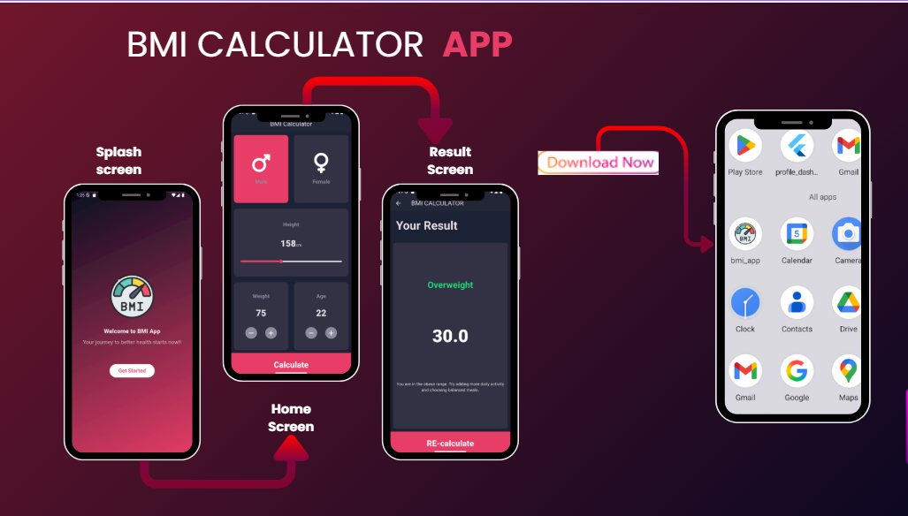

# 📱 BMI Calculator - Flutter  

A simple yet elegant **BMI (Body Mass Index) Calculator App** built with **Flutter**.  
The app allows users to input their height, weight, and age, then calculates the BMI and provides tailored advice about their health.  

---

## 🚀 Features  
- **Splash Screen** with gradient background and welcoming text.  
- **Gender Selection** (Male / Female) with custom cards.  
- **Height Input** with interactive slider.  
- **Weight & Age Controls** with plus/minus custom buttons.  
- **BMI Calculation** with detailed results and health advice.  
- **Result Screen** showing BMI value, category (Normal, Overweight, etc.), and tips.  
- Beautiful and clean **Material Design** UI.  

---

## 📌 Screens Overview  

- **Splash Screen** → Welcomes the user with app branding and "Get Started" button.  
- **Home Screen** → Main calculator interface with gender, height, weight, and age input.  
- **Result Screen** → Displays the calculated BMI, category, and advice with an option to recalculate.  
 
---

## 🖼 Screens  
  
